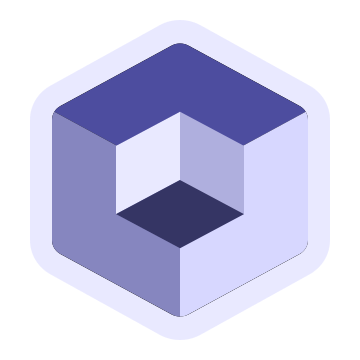

<!-- PROJECT LOGO -->
 

  

<h3 align="center">Polymerium</h3>

  

    Minecraft-Ready Instance Manager
     
    <a href="https://github.com/d3ara1n/Polymerium/wiki"><strong>View Docs »</strong></a>
     
     
    <a href="https://github.com/d3ara1n/Polymerium/issues">Feedback</a>
    ·
    <a href="https://github.com/d3ara1n/Polymerium/discussions">Discussion</a>
  

<!-- PROJECT SHIELDS -->
[![Contributors][contributors-shield]][contributors-url]
[![Forks][forks-shield]][forks-url]
[![Stargazers][stars-shield]][stars-url]
[![Issues][issues-shield]][issues-url]
[![MIT License][license-shield]][license-url]

<!-- ABOUT THE PROJECT -->

## I. About

[![Screenshot][product-screenshot]](#关于)

**It's in very early stage and most features are under development. Refer to [Roadmap](#roadmap) for progress.**

### 1. Concepts

As its stitched name suggests, Polymerium's main goal is to integrate Minecraft's game resources, rather than launching the game alone. It uses a completely different mindset than a launcher to manage game resources: creating instance metadata and using a deployment engine to restore the game's local files to the state described by the metadata; Polymerium doesn't maintain the game files, only the instance metadata.

Compared with other domestic game core concepts and version isolation models, Polymerium manages games with a more abstract concept of "game experience" and its concrete manifestation "instances". This approach combines the international mainstream modern management method with a little bit of personal flavor.

See [Core Concepts](https://github.com/d3ara1n/Polymerium/wiki/%E6%A0%B8%E5%BF%83%E6%A6%82%E5%BF%B5) for more information about Polymerium's patterns.

## 1.Philosophy

To introduce the MMC-style of game resource & instance organizing into the domestic ecosystem.

### 2.怎么又来一个?

这不是 *launcher*，也不是压缩毛巾，这是 Polymerium —— *游戏实例管理器*。
初衷是在用 PrismLauncher 的时候遇到一些问题并想出一些改进的的方法，不过在写代码、与 forge installer
斗智斗勇的过程中已经忘记哪些改进了（囧。现在要回答这个问题的话，那么答案是：没有为什么，小孩子不懂事写着玩的。

### 2.Why another launcher?

Go back read the last section and you get it.

### 3.跨平台

跨。跨了 Windows 10 和 Windows 11 两个“平台”。

### 3.Cross-platform

Available in Windows 10&11 only.

### 4.使用以下技术栈和工具构建 | Tech stack and toolchain

* [![C#][CSharp]][CSharp-url]
* [![dotnet][DotNet]][DotNet-url]
* [![WinUI3][WinUI]][WinUI-url]
* [![WindowsAppSDK][WindowsAppSDK]][WindowsAppSDK-url]
* [![Rider][Rider]][Rider-url]
* [![VisualStudio][VisualStudio]][VisualStudio-url]
* [![VisualStudioCode][VSCode]][VSCode-url]

<!-- FEATURES -->

## II.特色 | Features

- 🎨 Fluent Design & WinUI3
- 💾 增量部署，使用软链接节省硬盘空间 | Pooled file objects & Symlink deployment.
- 🎭 支持多账号且账号与实例绑定 | Instance linked multi account support.
- 🎟️ 多种在线仓库，与 Curseforge 和 Modrinth 集成 | Integrated with Curseforge & Modrinth.
- ☕ 手动配置 Java 并在运行时智能选择版本 | No stupid Java auto-detection. Configure Java once, configured every time.

<!-- GETTING STARTED -->

##  III.安装和使用 | Getting started

### 1.下载 | Download

### 2.开启 Windows 开发者模式

由于部署采用了 [Symbolic Link](https://www.wikiwand.com/en/Symbolic_link)，该功能需要管理员权限。
Windows
没有为打包的应用提供管理员权限申请能力，但提供了 [开发者模式](https://blogs.windows.com/windowsdeveloper/2016/12/02/symlinks-windows-10/)
来降低创建软连接的特权要求。

#### Windows 10

`设置` 👉 `更新和安全` 👉 `开发者选项` 👉 `开发人员模式`

#### Windows 11

`设置` 👉 `系统` 👉 `开发者选项` 👉 `开发人员模式`

#### 其他系统或其他 Windows

不需要。只有 Windows 需要在创建软连接时提供管理员权限，也只有 Windows 10+ 才能使用 WinUi3 打包应用。

### 2.Enable Windows Developer Mode

Due to Windows constraints in [symlink](https://www.wikiwand.com/en/Symbolic_link), instance deployment requires following additional steps to work.

#### Windows 10

Google it.

#### Windows 11

Google it.

#### Other OS

Install Windows 10 or 11 then Google it.

### 3.配置

开箱即用。

### 3.Setup

Available out of the box.

<!-- ROADMAP -->

## IV.Roadmap

* [x] 创建该项目
    * [x] 起名字
    * [x] 创建 Git 项目仓库
    * [x] 在目录里随处撒上魔术粉
* [ ] 实例管理
    * [ ] 从空模板创建
    * [ ] 导入
        * [x] 导入预览对话框
        * [ ] Poly-Pack
        * [x] CurseForge
        * [ ] Modrinth
        * [ ] MMC-Pack
    * [ ] 导出为 Poly-Pack
* [ ] 实例操作
    * [ ] 备份与还原
    * [ ] 内置副产品管理（游戏模组资源包着色器包等称为 Resource，抽象；当其作为文件存在于游戏目录称为 Asset，只读；当其存在元数据中成为
      Attachment，只读可固化为 Asset；游戏过程中产生的文件成为 Byproduct，可写且不断变化）
        * [ ] 服务器查看与预览
        * [ ] 存档查看与预览
* [ ] 账号管理
    * [ ] 账号提供方
        * [ ] Microsoft 账号登录
            * [x] 设备码添加账号
            * [ ] 可用性检查与刷新
        * [ ] authlib-injector 账号注入
    * [ ] 无网模式
* [ ] 部署引擎
    * [x] 基于 Iterator 模型
    * [x] 香草安装
    * [x] 加载器安装
        * [x] Forge
        * [x] NeoForge
        * [x] Fabric
        * [x] Quilt
        * [x] Trident Storage
    * [x] 固化与还原
    * [x] 基于文件池
* [x] 还原引擎
    * [x] 基于 Iterator 并发模型
* [x] 发射引擎
    * [x] 基于 Iterator 模型
* [x] 下载引擎
    * [x] 基于 Iterator 模型（错误的，什么都往这个模型套是过度设计，除了部署引擎本身就是串行的，其他引擎都是并行的，套到迭代器这种串行模型上面就是错误设计。真正的问题仅需
      `Parallel.ForEach(x => DownloadAsync(x))` 甚至 `Task.WaitAll`
      就能解决。但我还是要在未来实现它，因为并行工作用串行收集结果很优雅~）
* [x] 资源仓库
    * [x] CurseForge
        * [x] 整合包
        * [x] 模组
        * [x] 资源包
        * [x] 着色器包
    * [x] Modrinth
        * [x] 整合包
        * [x] 模组
        * [x] 资源包
        * [x] 着色器包
* [ ] 搜索
    * [ ] 搜索中心
        * [x] 互联网资源搜索
        * [x] 导入在线整合包
        * [x] 添加在线资源到本地实例
        * [ ] 收藏合集：为一个（新）实例添加一系列资源，用以对公共整合包快速个性化
* [x] 软件设置
* [x] 游戏实例设置
    * [x] 元数据编辑
    * [x] 私有启动配置页面
* [ ] 本地化

更多细节请在 [Issues](https://github.com/d3ara1n/Polymerium/issues) 中查询。

<!-- Privacy -->

## V.隐私与数据收集

Polymerium 没有遥测。

但会在部分保存或导出的数据文件中包含隐私数据，其中包括：

- 你的用户名：被包含在日志和临时文件中，通过 Home 目录暴露
- 你使用的操作系统类型：被包含在日志和临时文件中，且仅有唯一的值 Windows

上面有提到你的账号信息吗？没有，因为这部分信息不被保存在公共区域。

<!-- REFERENCES -->

## VI.资料和参考 | References

* 游戏启动流程、Fabric/Quilt 部署: [Inside a Minecraft Launcher][Inside-A-Minecraft-Launcher]
* 游戏启动流程: [教程/编写启动器][Tutorial-Making-Launcher]
* Forge: [ForgeWrapper][ForgeWrapperRepo]
* 微软验证: [Microsoft Authentication Scheme][Microsoft-Authentication-Scheme]

十分感谢以上作者和所著文章。

<!-- I_HATE_THIS_WORLD -->

## VII.吐槽

- Minecraft 官方的 Meta Launcher Api 给出的数据是多态模型
- CurseForge Api V1 不在文档中标注可能为 null 的数据
- Modrinth Api V2 不在文档中标注可能为 null 的数据，且不提供 V3 文档
- PrismLauncher 的 Meta Launcher Api 定义了一系列 "Component"，但每个 Component 都有自己独特的数据结构：他们只是看起来相似，在某些地方，例如对
  rules[].os 的定义，是不同的
- Modrinth 整合包中的资源清单不一定包含元数据，有些有，有些没有，导致无法提取
- Modrinth Api V2 的 Version.Loaders 字段中存在污染数据需要手动过滤

<!-- LICENSE -->

## License

Distributed under the MIT License. See `LICENSE.txt` for more information.

## Stats

<!-- MARKDOWN LINKS & IMAGES -->
<!-- https://www.markdownguide.org/basic-syntax/#reference-style-links -->

[contributors-shield]: https://img.shields.io/github/contributors/d3ara1n/Polymerium.svg?style=for-the-badge

[contributors-url]: https://github.com/d3ara1n/Polymerium/graphs/contributors

[forks-shield]: https://img.shields.io/github/forks/d3ara1n/Polymerium.svg?style=for-the-badge

[forks-url]: https://github.com/d3ara1n/Polymerium/network/members

[stars-shield]: https://img.shields.io/github/stars/d3ara1n/Polymerium.svg?style=for-the-badge

[stars-url]: https://github.com/d3ara1n/Polymerium/stargazers

[issues-shield]: https://img.shields.io/github/issues/d3ara1n/Polymerium.svg?style=for-the-badge

[issues-url]: https://github.com/d3ara1n/Polymerium/issues

[license-shield]: https://img.shields.io/github/license/d3ara1n/Polymerium.svg?style=for-the-badge

[license-url]: https://github.com/d3ara1n/Polymerium/blob/master/LICENSE.txt

[product-screenshot]: assets/images/Screenshot.gif

[CSharp]: https://img.shields.io/badge/C%23-12-239120?style=for-the-badge&logoColor=white

[CSharp-url]: https://learn.microsoft.com/en-us/dotnet/csharp/

[DotNet]: https://img.shields.io/badge/.NET-8-5C2D91?style=for-the-badge&logoColor=white

[DotNet-url]: https://dotnet.microsoft.com/

[WinUI]: https://img.shields.io/badge/WinUI-3-0F5197?style=for-the-badge&logoColor=white

[WinUI-url]: https://microsoft.github.io/microsoft-ui-xaml/

[WindowsAppSDK]: https://img.shields.io/badge/Windows%20App%20SDK-1.5-20000?style=for-the-badge&logoColor=white

[WindowsAppSDK-url]: https://github.com/microsoft/WindowsAppSDK

[Rider]: https://img.shields.io/badge/Rider-DE1369?style=for-the-badge&logo=Rider&logoColor=white

[Rider-url]: https://www.jetbrains.com/rider/

[VisualStudio]: https://img.shields.io/badge/Visual_Studio-5C2D91?style=for-the-badge&logo=visual%20studio&logoColor=white

[VisualStudio-url]: https://visualstudio.microsoft.com

[VSCode]: https://img.shields.io/badge/Visual_Studio_Code-0078D4?style=for-the-badge&logo=visual%20studio%20code&logoColor=white

[VSCode-url]: https://code.visualstudio.com/

[Inside-A-Minecraft-Launcher]: https://ryanccn.dev/posts/inside-a-minecraft-launcher

[Tutorial-Making-Launcher]: https://minecraft.fandom.com/zh/wiki/%E6%95%99%E7%A8%8B/%E7%BC%96%E5%86%99%E5%90%AF%E5%8A%A8%E5%99%A8

[ForgeWrapperRepo]: https://github.com/ZekerZhayard/ForgeWrapper

[Microsoft-Authentication-Scheme]: https://wiki.vg/Microsoft_Authentication_Scheme
